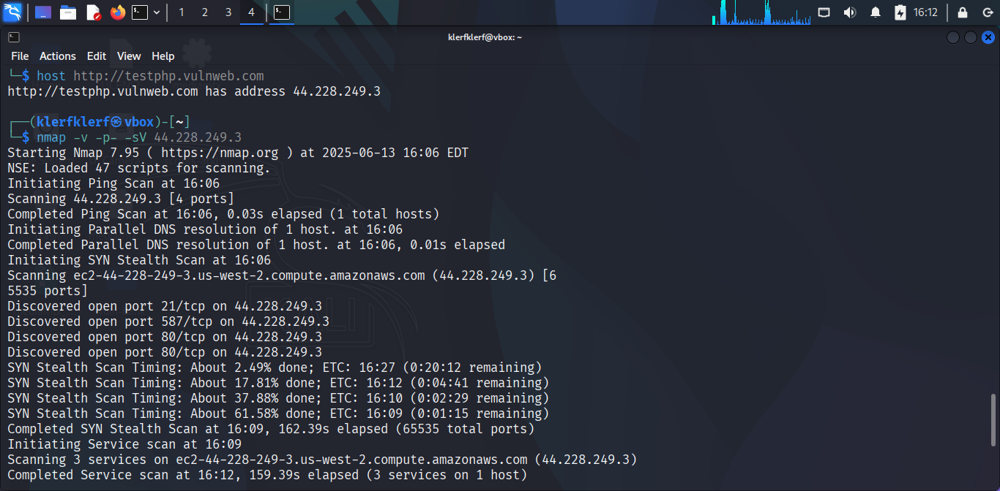

# Introduction
These tasks involved identifying open ports, performing a directory
brute force, and intercepting network traffic to capture login
credentials on the website `http://testphp.vulnweb.com/`. This repo
details the steps taken, tools used, analysis, impact, and mitigation
strategies for each task, utilizing Kali Linux as my primary machine.

# Task Level: Beginner

| S.NO  | TITLE                                                                 |
|------|------------------------------------------------------------------------|
| 1     | Find all the ports that are open on the website `http://testphp.vulnweb.com/` |
| 2     | Brute force the website `http://testphp.vulnweb.com/` and find the directories that are present on the website.|
| 3     | Log in to the website `http://testphp.vulnweb.com/` and intercept the network traffic using Wireshark and find the credentials that were transferred through the network.|

Machine Used : Kali Linux

# Information

-   **Port Scanning & Service Detection:** This technique involves
    probing a target system to discover open ports and services. For
    Task 1, I used port scanning to identify accessible entry points on
    `http://testphp.vulnweb.com/`, providing insight into potential
    vulnerabilities.

-   **Directory Brute Forcing:** This method attempts to guess hidden
    directories and files on a web server using a wordlist. In Task 2, I
    employed directory brute forcing to uncover directories on the
    target website, revealing potentially sensitive or misconfigured
    areas.

-   **Network Traffic Analysis:** This process involves capturing and
    analyzing network packets to extract information. For Task 3, I used
    network traffic analysis to intercept and identify login credentials
    transmitted during a login attempt on the website.

# Task 1 - Find all the ports that are open on the website `http://testphp.vulnweb.com/`

**Attack Name:** Port Scanning

**Severity:** Low

**Reason:** Port scanning is a reconnaissance technique that identifies
open ports and services, posing a low immediate threat, but can be a
precursor to more severe attacks if vulnerabilities are exploited.

**Steps Taken**

1.  Used the command, `host http://testphp.vulnweb.com` to discover the IP
    address, which returned `44.228.249.3`.

2.  Initiated an Nmap scan with the command \`nmap -v -p -sV
    44.228.249.3\` to identify open ports and services.

3.  Reviewed the scan results for open ports and associated services.

**Analysis**

The Nmap scan revealed the following open ports:

-   21/tcp: ftp

-   80/tcp: http (nginx 1.19.0)

-   587/tcp: submission

**Impact**

-   Exposure of open ports can allow attackers to identify potential
    entry points for further exploitation.

-   Additionally, the nginx version 1.19.0, identified on port 80, could
    be susceptible to exploits, increasing the risk of remote code
    execution, denial-of-service attacks, or unauthorized access.

**Mitigation**

- Regularly update and patch services.

- Use firewalls to restrict unnecessary port access.

- Monitor network traffic using IDS, such as Snort, for unusual activity.

**Tools Used**

-   host

-   Nmap
  

# Task 2: Brute force the website `http://testphp.vulnweb.com/` and find the directories.

**Attack Name:** Directory Brute Forcing

**Severity:** Medium

**Reason:** Directory brute forcing can expose hidden or sensitive
directories, thereby increasing the risk of unauthorized access if not
properly secured.

**Steps Taken**

1. Executed a Dirb scan with the command `dirb http://testphp.vulnweb.com/`.

2. Dirb utilized the wordlist `/usr/share/dirb/wordlists/common.txt` to generate words likely to be directory names.

3. Analyzed the output for discovered directories.

**Analysis**

The Dirb scan identified the following directories and more:

-   /admin/

-   /cgi-bin/

-   /crossdomain.xml

-   /CVS/

-   /Entries

-   /CVS/Repository

-   /CVS/Root

-   /favicon.ico

-   /images/

-   /index.php

-   /pictures/

-   /secured/

-   /vendor/

**Impact**

Exposure of directories can lead to access to sensitive information or
misconfigured services. A major concern here for me was the admin
directory, which was also indexed.

**Mitigation**

-   Disable directory indexing.

-   Enforce access controls and authentication.

-   Audit and remove unused directories regularly.

**Tools Used**

-   Dirb

# Task 3: Log in to the website `http://testphp.vulnweb.com/` and intercept network traffic using Wireshark to find the credentials.

**Attack Name:** Network Traffic Interception

**Severity:** High

**Reason**

Interception of unencrypted credentials poses a high risk as it can lead
to unauthorized access to user accounts.

**Steps Taken**

1. Accessed the login page at `http://testphp.vulnweb.com/login.php`.

2. Used Wireshark to capture network traffic on the eth0 interface.

3. Logged in with the credentials: username **prince** and password **lassey**

4. Filtered the capture to identify the HTTP POST request containing
the credentials.

**Analysis**

The Wireshark capture showed a POST request to /userinfo.php with the
credentials:

-   Username: **prince**

-   Password: **lassey**

The traffic was unencrypted, indicating a potential vulnerability.

**Impact**

Unencrypted credential transmission can result in account compromise and
data breaches.

**Mitigation**

-   Enforce HTTPS to encrypt traffic rather than HTTP.

-   Implement strong authentication mechanisms.

-   Educate users on secure login practices.

**Tools Used**

-   Wireshark
